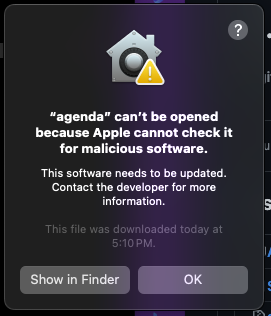
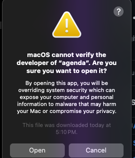

# Installation 

You just need to download the workflow from the [Releases Page](https://github.com/guildencrantz/agenda.alfredworkflow/releases)
and then open it: Alfred should install it for you. You can delete the downloaded
workflow file once it's been installed.

## Error Warning

The first time you execute this workflow you'll see a macOS warning:

To allow the `agenda` app (used to talk to the calendar for events and reminders)
you can hit the `Show in Finder` button. Right click on the `agenda` binary and
hold down the `option` key on your keyboard: The menu should now show `Always Open`
as the second item, however if you press `Open` (the first item) you should get
pop-up that's _very_ similar to the first one, only this one has an `Open` button:

If you click `Open` it'll open in the `termal`: You can just close that `terminal`
window and the workflow should be working.

# Acknowledgement

This project is the merger of a fork of [rknightuk/alfred-reminders-helper](https://github.com/rknightuk/alfred-reminders-helper)
combined with a fork of the [rknightuk/alfred-workflows/workflow/agenda](https://github.com/rknightuk/alfred-workflows/tree/main/workflows/agenda)
workflow dropped into a single repo and tweaked.
