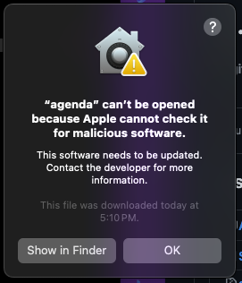

# Installation 

You just need to download the workflow from the [Releases Page](https://github.com/guildencrantz/agenda.alfredworkflow/releases)
and then open it: Alfred should install it for you. You can delete the downloaded
workflow file once it's been installed.

## Error Warning

The first time you execute this workflow you'll see a macOS warning:



To allow the `agenda` binary to run:

1. In Alfred Preferences, find the **Agenda** workflow in the sidebar
2. Right-click it and choose **Open in Terminal** — this will open a terminal in the workflow's directory
3. Run the following command in that terminal:

```bash
xattr -dr com.apple.quarantine agenda
```

After that the workflow should work normally.

# Acknowledgement

This project is the merger of a fork of [rknightuk/alfred-reminders-helper](https://github.com/rknightuk/alfred-reminders-helper)
combined with a fork of the [rknightuk/alfred-workflows/workflow/agenda](https://github.com/rknightuk/alfred-workflows/tree/main/workflows/agenda)
workflow dropped into a single repo and tweaked.
